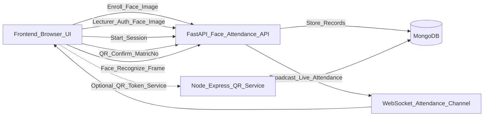

# Roll-Call

> A hybrid attendance system (FaceID + QR fallback) for classroom sessions — built for fast enrollment, live scanning, and audit-friendly session history.

---

## 🎯 The Problem

Manual attendance is slow, error-prone, and easy to game. Even when FaceID is available, you still need a **reliable fallback** when lighting, cameras, or devices fail.

---

## 💡 The Solution

Roll-Call is a browser-based attendance workflow with a Python FastAPI backend for **face recognition** and **QR confirmation**, plus an optional Node/Express QR-token service for session-locked QR tokens.

**Key Features:**
- **Unified enrollment (Student/Lecturer)**: capture a face image, store encoding, generate a digital ID QR for backup (`frontend/pages/enroll.html` → `POST /students/enroll`, `POST /lecturers/enroll`).
- **Lecturer login via FaceID**: authenticate approved lecturers before they can start sessions (`frontend/pages/lecturer.html` → `POST /lecturers/authenticate`).
- **Session-based attendance**: start a live session, scan students, end session, and persist confirmed records (`POST /attendance/start_session`, `POST /attendance/end_session/{session_id}`).
- **Mode switching**: switch between **QR** and **Face** during an active session (`POST /attendance/switch_mode/{session_id}`).
- **Admin panel**: approve lecturers, manage courses, and export detailed attendance history (`frontend/pages/admin.html`).

---

## 🛠️ Tech Stack

**Core:**
- **Frontend**: HTML + CSS + Vanilla JS (simple deployment, runs anywhere)
- **Backend (Face + Attendance API)**: FastAPI + Uvicorn (Python)
- **Database**: MongoDB (student/lecturer/course/session records)

**Face Recognition & Imaging:**
- **`face_recognition`**: face encoding + matching (primary recognition layer)
- **OpenCV (`opencv-python`)**: installed as part of the imaging stack used by the backend (camera/image pipeline support)
- **NumPy + Pillow**: image/array utilities used in encoding & verification

**QR / Scanning:**
- **`qrcodejs` (CDN)**: client-side QR generation (digital ID)
- **`jsQR` (CDN)**: QR decoding in browser camera stream (lecturer panel QR mode)

**Optional (Secure QR token service):**
- Node.js + Express + Mongoose (`qr_backend/`) for session-locked QR tokens and signature verification.

---

## 🚀 Installation

### Prerequisites
- **Python 3.10+**
- **Node.js 18+** (only if you want to run the optional Node QR service)
- **MongoDB** running locally or a hosted MongoDB URI

---

### 1) Run the FastAPI backend (Face + Attendance API)

From the repo root:

```bash
cd py-backend
python -m venv venv
source venv/Scripts/activate
pip install -r requirements.txt
```

Create a `.env` in `py-backend/` (or set environment variables):

```bash
MONGO_URI=mongodb://localhost:27017
FACE_MATCH_TOLERANCE=0.4
```

Start the API:

```bash
uvicorn face_attendance_backend:app --reload
```

The frontend expects the API at `http://localhost:8000`.

---

### 2) Run the frontend

Open any of these pages directly in your browser (or serve `frontend/` with a static server):

- `frontend/pages/index.html` (entry)
- `frontend/pages/enroll.html` (student/lecturer enrollment)
- `frontend/pages/lecturer.html` (lecturer login + sessions)
- `frontend/pages/admin.html` (approvals + courses + history)

---

### 3) (Optional) Run the Node QR token backend

This service lives in `qr_backend/` and exposes QR token endpoints on port **5000**.

```bash
cd qr_backend
npm install
node app.js
```

Endpoints:
- `POST /api/qr/generate-qr`
- `POST /api/qr/verify-qr`

---

## 📖 Usage

### Enrollment
- Go to `frontend/pages/enroll.html`
- Choose **Student** or **Lecturer**
- Enter Name + ID (matric/staff ID), capture face, submit
- Students receive a **digital ID QR** for QR-mode attendance fallback

### Lecturer flow (session attendance)
- Go to `frontend/pages/lecturer.html`
- **Scan Face & Login**
- Select course + mode (QR or Face) → **Start Session**
- During the session:
  - **QR mode**: scan a student’s matric number QR → backend confirms attendance
  - **Face mode**: submit live camera frames for blind face match → backend confirms attendance
- **End Session** to persist confirmed records

### Admin flow
- Go to `frontend/pages/admin.html`
- Approve pending lecturers
- Create/assign courses
- Export attendance history

---

## 🏗️ How It Works (Architecture)



**Core session endpoints (FastAPI):**
- `POST /attendance/start_session?course_id=...&lecturer_id=...&mode=qr|face`
- `POST /attendance/switch_mode/{session_id}`
- `POST /attendance/qr_confirm/{session_id}/{matric_no}`
- `POST /attendance/face_recognize/{session_id}` (image upload)
- `POST /attendance/end_session/{session_id}`
- `GET /attendance/history`

**Enrollment & admin endpoints (FastAPI):**
- `POST /students/enroll`
- `POST /lecturers/enroll`
- `POST /lecturers/authenticate`
- `GET /lecturers/pending`, `POST /lecturers/approve/{staff_id}`, `GET /lecturers/all`
- `POST /courses`, `GET /courses`
- `GET /admin/attendance/detailed_history`

---

## 🚧 Challenges & Solutions

### Dual-mode attendance without breaking the flow
**Problem:** Face recognition can fail in real-world conditions; QR-only can be shared.  
**Solution:** Session-based mode switching + QR confirmation fallback, while still keeping an auditable history in MongoDB.

---

## 🔮 Future Improvements (Version 2)

- [ ] Add role-based auth (admin/lecturer) and lock down CORS for production
- [ ] Replace local-only URLs with environment-based config for deploys
- [ ] Attendance reports (CSV/Excel) per course + per session
- [ ] Better QR security integration (tie QR confirmation to signed tokens + expiry)

---

## 🤝 Credits

Built collaboratively by:
- **Olowofela David** — spearheaded the Python/FastAPI face recognition backend
- **Japheth O. Egbedele** — frontend implementation + Node.js QR work + backend support toward the end

---

## 📄 License

This project is licensed under the MIT License — see [LICENSE](LICENSE).